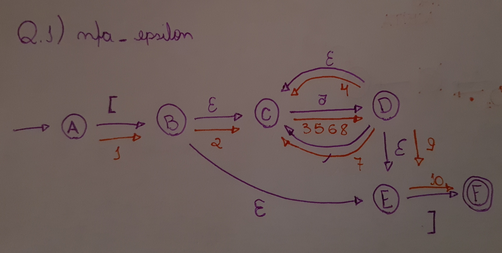
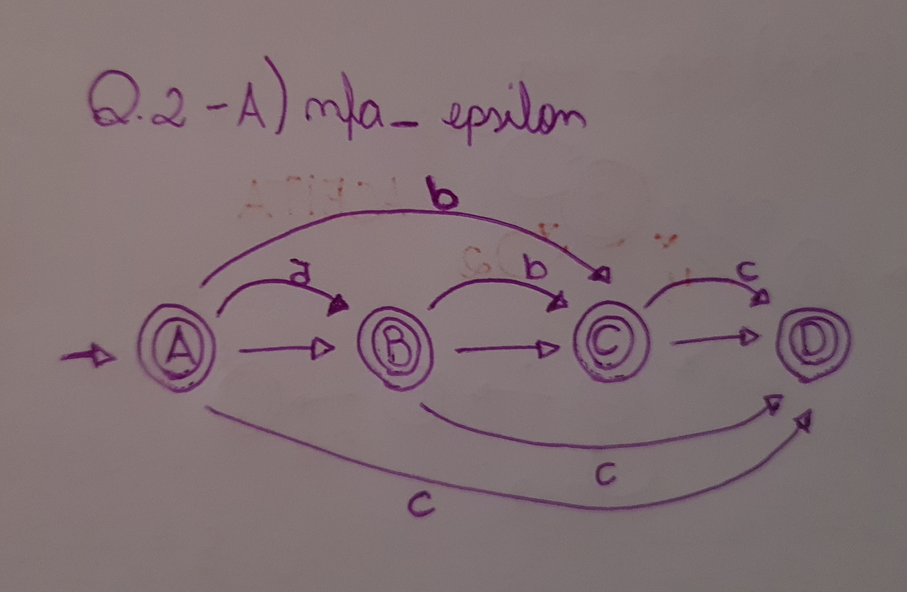
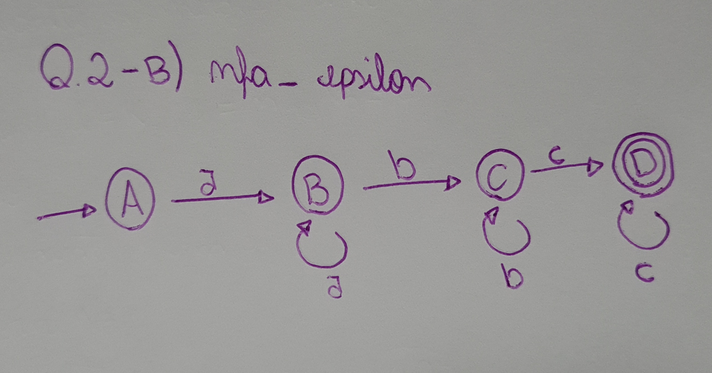

# NFA_EPSILON

## Q1

### 1



### 2

```
A ---> B ---> C ---> D ---> C ---> D ---> C ---> D ---> E ---> F
   [      ε      a      ε      a      ε      a      ε      ]
```

## Q2

### A



### B

