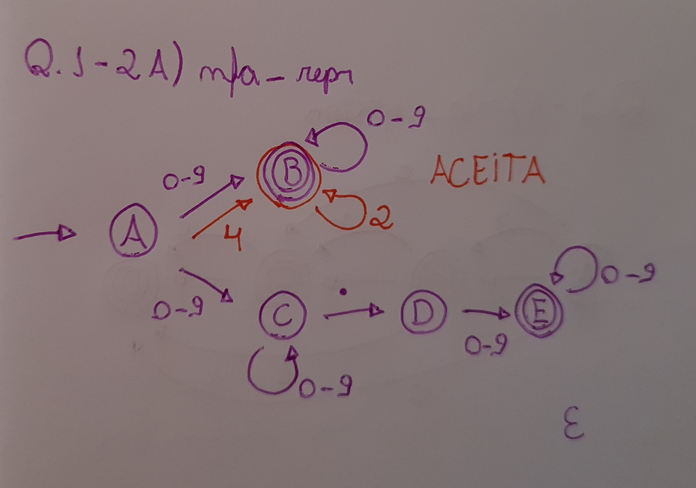
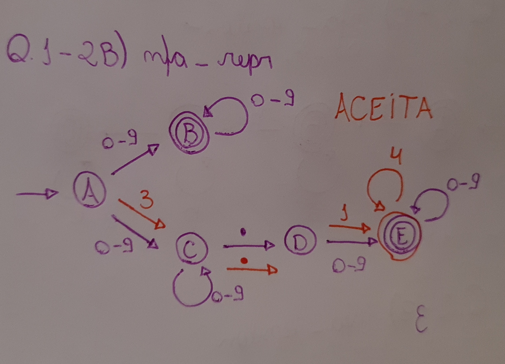
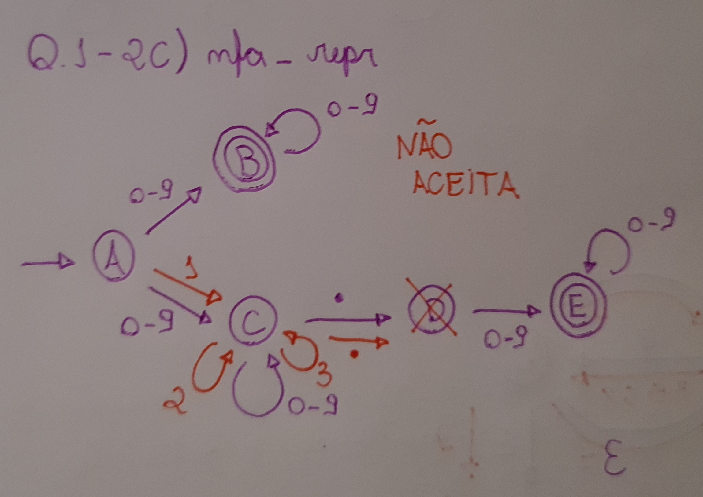
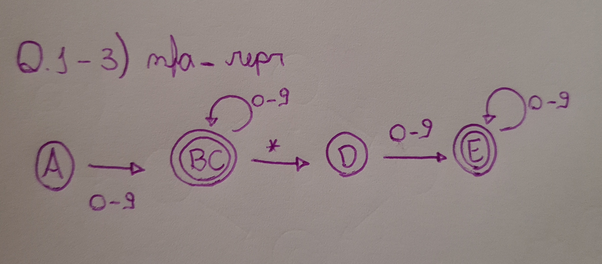
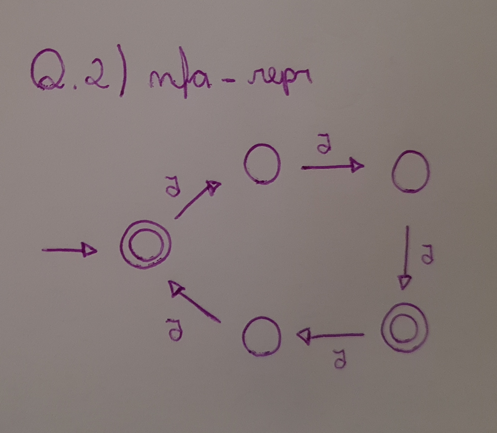

# NFA_REPR

## Q1

### 1
* As transições que estão saindo do ponto inicial A possuem mais de um caminho que pode ser escolhido, tornando-o, assim, um NFA.

### 2

* A) 42

* B) 3.14

* A) 123.

### 3

## Q2

